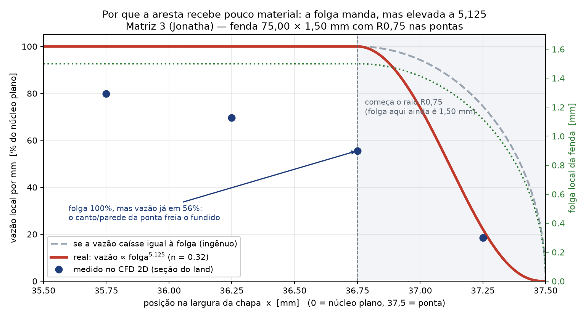

# Avaliação independente — a Matriz 3 (Jonatha v27) pode melhorar?

**Data:** 11/09/2026 · **Escopo:** avaliar, calcular e simular. **Nenhum arquivo do modelo aprovado foi alterado.**
Todos os resultados deste trabalho estão em arquivos **novos**, listados na seção 11.

> **Método (declarado com honestidade):** todo o cálculo é próprio — CFD 2D escrito nesta sessão
> (gmsh para malha + scikit-fem para o elemento finito P2), mais integração 1D fatiada da geometria
> medida nos STEP oficiais e correlações analíticas clássicas. **Não** é CFD comercial, **não** tem
> viscoelasticidade nem superfície livre (inchaimento é estimado por correlação), e o canal inteiro
> em 3D não foi resolvido (custo inviável: ~15 min por fatia de 8,4 mm). O que isso significa na
> prática está na seção 10.

---

## 1. Resposta curta

**Sim, a Matriz 3 pode melhorar — mas o ganho não está onde a discussão vinha sendo feita.**

O canal da Jonatha está bem projetado hidraulicamente: **69,5% da perda de carga acontece no land**,
que é exatamente o que se quer num cabeçote de chapa (o land é o "resistor de distribuição"), e o
núcleo de 73,5 mm de chapa plana entrega vazão uniforme dentro de **±5% em 92,3% da largura**.
O que limita a qualidade da chapa, pela ordem, é:

1. **a folga da fenda** — a vazão varia `5,125 × (Δfolga/folga)`: 10 µm de erro na fenda de 1,50 mm
   já dão 3,4% de variação de espessura. Fixação e deflexão das metades são o item nº 1;
2. **o land real de 8,5 mm** (não conformidade já registrada contra os 10,00 mm do SSOT);
3. **o chanfro de saída de 1,50 mm**, que come 1,5 mm de land paralelo e deixa só **0,75 mm de aço**
   no lábio;
4. o regime de **puxada/inchaimento** (processo, não CAD);
5. a **residência na parede do funil** (minutos, não segundos) — risco de degradação/gel.

**O que NÃO aparece como problema:** a distribuição transversal no land (núcleo dentro de ±5%), a
forma do funil (o 1D e o 2D concordam; não há necessidade de trocar o funil por um *coat-hanger*) e
a aresta R0,75 (a borda recebe menos material por mm, o que é consequência esperada do próprio raio).

---

## 2. Validação dos números (antes de qualquer conclusão)

Nada aqui vale se os números não fecham. Foram feitas quatro amarrações independentes:

| Verificação | Resultado | Desvio |
| :--- | :--- | :--- |
| Gradiente no land — **CFD 2D** (Z = 99,5 / 103 / 107) | 2,1761 bar/mm | — |
| Gradiente no land — **fórmula analítica** de lei das potências (fenda 75,00 × 1,50, h = H/2) | 2,189 bar/mm | **0,6%** |
| Gradiente no land — **1D fatiado** do STEP, passo 0,5 mm | 2,1866 bar/mm | **0,5% vs CFD** |
| Tensão de parede no land — CFD 2D vs analítica | 160,89 vs 163,83 kPa | 1,8% |
| Estudo paramétrico de borda, caso "alívio = 0" (geometria sintética) vs seção real | 2,1761 bar/mm e 160,95 kPa | **idêntico** |

Todas as três cotas do land (Z = 99,5 / 103 / 107) dão **exatamente** o mesmo resultado — ou seja, o
land é plenamente desenvolvido desde Z = 99,5 e a fenda **não** continua afunilando dentro do land.

> **Correção registrada nesta avaliação.** A fórmula da fenda larga usada nos documentos anteriores
> tinha um fator extra `(1+n)/n`, que inflava o ΔP em `((1+n)/n)^n = 1,573×`. Os valores corretos
> estão na seção 3 e já foram propagados para `verify_legacy_dies.py`, `cad_die_parameters.json` e
> `TRIAGEM_DE_PROBLEMAS_DAS_MATRIZES.md`. Um valor de ~49 bar para a Jonatha foi comunicado durante
> esta sessão: **estava errado** — o correto é 26,6 bar.

---

## 3. Linha de base medida

| Matriz | land medido | ΔP 1D corrigido | ΔP declarado | razão |
| :--- | ---: | ---: | ---: | ---: |
| 1 — Copo (original) | 9,95 mm | 23,8 bar | 185,4 bar | 0,13× ❌ (o 1D não captura o degrau de 90°) |
| 2 — Gedeon | 88,00 mm | 194,2 bar | 268,7 bar | 0,72× |
| Desenvolvimento | 10,00 mm | 31,3 bar | — | — |
| **Jonatha v27 (oficial)** | **8,50 mm paralelos** | **26,6 bar** | 68,2 bar | **0,39× ❌** |

O ΔP declarado da Jonatha (68,2 bar) é **2,6× o medido**. A diferença é folga a favor da extrusora —
mas significa que o número usado para especificar bomba e pressão de trabalho está errado para cima,
e que a margem real é maior do que se pensava.

### Perda de carga por zona (1D fatiado, geometria medida, Q = 15 cm³/s)

| Zona | Z (mm) | Δp (bar) | % do total |
| :--- | :--- | ---: | ---: |
| Entrada + funil | 0 – 90 | 1,95 | 7,3% |
| Aproximação do land (última compressão) | 90 – 99 | 4,82 | 18,1% |
| **Land paralelo** | **99 – 107,5** | **18,55** | **69,5%** |
| Chanfro de saída | 107,5 – 109 | 1,36 | 5,1% |
| **Total** | 0 – 109 | **26,68** | 100% |

> As quatro zonas são diferenças da integral cumulativa do gradiente nas fronteiras z = 90 / 99 /
> 107,5 mm — somam exatamente o total. (Uma primeira versão integrava máscaras de faixa e perdia
> 2,07 bar nas fronteiras; os números acima são os corretos.)

Esse é o "modelo de escoamento desenvolvido". A convergência do funil tem uma parcela **extensional**
que ele não captura: estimando com a taxa de deformação axial medida (máx. 39 1/s, em Z = 107) e
η_E = TR·K·ε̇^(n−1), ela vale **+4,4 bar com Trouton 3×** e **+14,6 bar no limite de 10×**. Portanto:

> **Δp do canal ≈ 27 bar (piso) a 41 bar (teto), mais provável ≈ 31 bar.**

---

## 4. Uniformidade ao longo dos 75 mm (CFD 2D por seção)

| Z (mm) | área (mm²) | altura máx. (mm) | G (bar/mm) | uniformidade q_mín/q_máx | τ parede (kPa) |
| ---: | ---: | ---: | ---: | ---: | ---: |
| 70,0 | 1.204,7 | 23,205 | 0,0379 | 83,9% ¹ | 28,97 |
| 95,0 | 253,4 | 4,493 | 0,4758 | 91,8% ¹ | 80,23 |
| 99,5 | 112,02 | 1,500 | 2,1761 | **52,3%** | 160,89 |
| 103,0 | 112,02 | 1,500 | 2,1761 | **52,3%** | 160,89 |
| 107,0 | 112,02 | 1,500 | 2,1761 | **52,3%** | 160,89 |

¹ nas seções do funil a métrica compara as faixas **centrais** de altura plena (o resto da seção é
borda moldada); é indicador de regularidade, não de uniformidade de chapa.

### O que a métrica de 52,3% do land quer dizer (e o que ela **não** quer dizer)

No land, o trecho de chapa plana (|x| ≤ 36,75 mm, ou 73,50 mm = **98% da largura**) tem:

* q médio = **202,8 mm³/s·mm⁻¹**;
* **92,3% da vazão do núcleo cai dentro de ±5%** da média do núcleo e 97,0% dentro de ±10%;
* o mínimo acontece no fim do trecho plano (x = 36,75 mm): q = 112,7, ou **52,3% do máximo**.

O perfil nos últimos 2 mm de cada lado:

| x (mm) | 35,75 | 36,25 | 36,75 | 37,25 |
| :--- | ---: | ---: | ---: | ---: |
| q (mm³/s·mm⁻¹) | 162,1 | 141,1 | 112,7 | 37,6 |

Integrando: **os últimos 1,0 mm de cada lado levam 0,63% da vazão total** (47 mm³/s·mm⁻¹, isto é 23%
da média do núcleo). A aresta é "faminta": ela entrega menos material por mm de largura, logo sai
mais fina depois da puxada. **Isso é o esperado e é coerente com o R0,75 especificado** — a aresta
arredondada é, por construção, mais fina que o corpo da chapa.

### 4.1 Por que a aresta recebe pouco material — explicação intuitiva



**A conta que governa tudo.** Numa fenda, a vazão por milímetro não é proporcional à folga — é
proporcional à folga **elevada a `(2n+1)/n`**. Com o `n = 0,32` deste material, isso dá
**folga^5,125**. Ou seja: fechar a folga em 1% custa **5,2% de vazão**; fechar em 10% custa **63%**.

Por que um expoente tão cruel? Porque duas coisas se somam:

1. **Área:** menos folga é menos passagem (efeito linear, todo mundo espera);
2. **Velocidade:** o polímero fundido não é água — ele é quase um *bloco* que desliza, e quem manda
   na velocidade do bloco é o atrito na parede. Tensão na parede = `G·h/2`, e a taxa de cisalhamento
   que o material aguenta responde a essa tensão com expoente `1/n` = **3,1**. Folga 1% menor →
   tensão 1% menor → o material cisalha 3,1% mais devagar → o bloco anda 3,1% mais devagar.
   Somando com a área: **1% + 3,1% ≈ 5,1%** — o expoente `2 + 1/n`.

**Analogia:** pense no fundido como uma barra de borracha deslizando entre duas chapas, sobre uma
camada fina de graxa. A barra só anda porque a graxa cisalha. Aproxime as chapas em 1%: a barra fica
1% mais fina (menos vazão) **e** a graxa passa a cisalhar mais devagar, derrubando a velocidade de
toda a barra em mais 3,1%.

**Aplicando isso à aresta R0,75** (o gráfico acima):

| posição x (mm) | folga local (mm) | "se caísse junto com a folga" | **real: (folga/1,5)^5,125** |
| ---: | ---: | ---: | ---: |
| 36,750 | 1,500 | 100% | **100%** |
| 36,938 | 1,452 | 96,8% | **84,8%** |
| 37,125 | 1,299 | 86,6% | **47,9%** |
| 37,275 | 1,071 | 71,4% | **17,8%** |
| 37,350 | 0,900 | 60,0% | **7,3%** |
| 37,425 | 0,654 | 43,6% | **1,4%** |
| 37,462 | 0,468 | 31,2% | **0,3%** |

Integrando: **a aresta (2 × 0,75 = 1,50 mm de largura, 2% da chapa) entrega apenas 48,6% do que
entregaria se fosse um trecho plano de mesma largura.** Metade da capacidade, jogada fora — não por
defeito, mas porque o R0,75 fecha a folga até zero.

**E há um segundo efeito, que não é a folga.** O gráfico mostra os pontos medidos no CFD:

| x (mm) | folga | medido no CFD | o que explica |
| ---: | ---: | ---: | :--- |
| 35,75 | 1,500 | 79,9% do núcleo | proximidade do canto começa a frear |
| 36,25 | 1,500 | 69,6% do núcleo | idem |
| **36,75** | **1,500** | **55,6% do núcleo** | **folga ainda é 100% — quem derruba é o canto** |
| 37,25 | 1,118 | 18,5% do núcleo | aqui a folga já responde por ~22% (regra) |

Ou seja: **mesmo antes de a folga começar a cair, a vazão já caiu quase à metade**. A razão é que,
perto da ponta, o fundido não sente só as duas paredes de cima e de baixo — ele sente também a parede
da ponta arredondada, a poucas décimas de milímetro de distância. A fenda deixa de ser "duas placas
paralelas" e vira um **duto pequeno**, com muito mais parede por unidade de vazão. É um **canto
viscoso**: o mesmo esforço que empurra o bloco no meio da chapa é gasto arrastando o material contra
três lados.

**O que isso significa na prática**

* A aresta **sai fina de propósito**: espessura equivalente ≈ 0,6 mm a 0,5 mm da ponta, caindo a zero
  na ponta. É o desenho do R0,75, não um erro de fabricação.
* **Não é possível ter as duas coisas:** R0,75 e espessura cheia de 1,50 mm até a borda. Se o cliente
  precisar de espessura plena na borda, o raio tem de sair do projeto (ou a borda tem de ser cortada
  depois).
* **A aresta é o ponto mais sensível da matriz.** Como a vazão depende da folga elevada a 5,125,
  0,05 mm a mais ou a menos na região do raio muda a aresta em dezenas de por cento — é aí que
  desgaste, rebarba ou polimento irregular aparecem primeiro.
* Se um dia a aresta precisar ser mais cheia, o botão é o **alívio de borda** estudado na seção 5:
  +150 µm de folga na região da rampa levam a espessura equivalente da ponta de 0,61 mm para 1,11 mm
  (+82%) — mas isso muda o raio de saída.

> **Correção de uma leitura anterior desta sessão.** Em um primeiro momento a interpretação do
> perfil sugeria que "as pontas levariam metade da vazão". A medição corrigida mostra o **oposto**:
> as pontas levam **menos** vazão por mm. A origem do engano era a máscara de cálculo do perfil.
> O número correto é o desta seção.

---

## 5. Estudo paramétrico: alívio de borda (novo)

Foi resolvido um canal paramétrico de 75,00 × 1,50 mm com R0,75 nas pontas, no qual os últimos
~7,5 mm de cada lado recebem uma rampa de engrossamento (alívio) antes da ponta — ver
`04_Dados_SSOT_e_Scripts/cfd_edge_relief.py`. Cada caso foi resolvido em processo separado do gmsh
(o OCC corrompe o estado entre geometrias no mesmo processo).

| alívio (µm) | uniform. do núcleo | esp. equivalente mín. nos 2 mm finais | q no centro | G (bar/mm) | Δp em 8,5 mm | τ parede (kPa) |
| ---: | ---: | ---: | ---: | ---: | ---: | ---: |
| 0 | 77,6% | 0,126 mm | 228,5 | 2,1761 | 18,50 | 160,95 |
| 25 | 88,2% | 0,132 mm | 213,9 | 2,1629 | 18,38 | 160,53 |
| 50 | 86,2% | 0,154 mm | 208,8 | 2,1492 | 18,27 | 160,09 |
| 75 | 88,3% | 0,165 mm | 199,3 | 2,1348 | 18,15 | 159,59 |
| 100 | 77,1% | 0,199 mm | 200,6 | 2,1200 | 18,02 | 159,06 |
| 150 | 83,8% | 0,222 mm | 195,8 | 2,0886 | 17,75 | 157,88 |

**Leitura:** o alívio engorda a aresta de forma monotônica — a espessura equivalente dos últimos 2 mm
vai de 0,126 mm para **0,222 mm (+76%)** com 150 µm, e a espessura equivalente em x = 37 mm
(praticamente a ponta) vai de **0,607 mm para 1,105 mm (+82%)**. O núcleo **não** muda (as oscilações
de 77–88% são ruído de malha: o núcleo já está dentro de ±5%), o gradiente cai 4% e a tensão de
parede cai 2%. Vazão conferida em 15.000 mm³/s em todos os casos.

**Conclusão do estudo:** o alívio é um **engordador de aresta**, não um corretor de uniformidade. E o
desenho acima **muda o raio de saída** (R0,75 → R(0,75+d)), o que conflita com a especificação atual
de aresta. Se um dia for usado, tem de ser aplicado **a montante do lábio**, mantendo a ponta em
R0,75. Como a aresta fina é a peça especificada do projeto, **não recomendo mexer nisso agora** —
o estudo fica como mapa de sensibilidade.

---

## 6. Land e chanfro de saída

| Configuração | land útil | Δp no land | lábio de aço | Δp total | variação |
| :--- | ---: | ---: | ---: | ---: | ---: |
| **atual** (chanfro 1,50 × 45°) | 8,5 mm | 18,59 bar | 0,75 mm | 26,68 bar | — |
| chanfro 0,80 × 45° | 9,2 mm | 20,12 bar | 1,45 mm | 27,57 bar | +3,3% |
| chanfro 0,50 × 45° | 9,5 mm | 20,77 bar | 1,75 mm | 27,96 bar | +4,8% |
| land 10,0 mm paralelos | 10,0 mm | 21,87 bar | 0,75 mm | 29,96 bar | +12,3% |
| land 12,0 mm paralelos | 12,0 mm | 26,24 bar | 0,75 mm | 34,33 bar | +28,7% |

* **Chanfro menor é o melhor negócio**: 0,5–0,8 mm devolve 0,7–1,0 mm de land paralelo **e** engrossa
  o lábio de aço de 0,75 mm para 1,45–1,75 mm (o lábio de 0,75 mm é o item P7 da triagem), por ~4% de
  pressão. O chanfro existe para proteger a aresta do lábio; 0,5 mm ainda cumpre isso.
* **Land de 10 mm** custa +12,3% de pressão e sobe a fração do land de 69,5% para ~73% do Δp —
  mais robustez de distribuição contra perturbações a montante. Alinha o desenho com o SSOT.
* **Land de 12 mm não se justifica**: +28,7% de pressão para ganho marginal de distribuição (o
  núcleo já está em ±5%).
* O chanfro de saída é **divergente** (a seção cresce de 1,5 para ~4,5 mm em 1,5 mm de comprimento,
  verificado no fatiamento: a altura só volta a crescer em Z = 107–108,5). É onde aparece a maior
  taxa de deformação axial (39 1/s) e é o único ponto do canal com tendência a recirculação nos
  cantos — mais um motivo para reduzir esse chanfro.

---

## 7. Mecânica: força de abertura, deflexão e sensibilidade da folga

**Força de abertura no plano de partição** (integral do perfil de pressão sobre a área projetada:
109 mm de canal × 75 mm de largura = 8.175 mm²):

| Grandeza | Valor |
| :--- | ---: |
| Pressão média ponderada | 24,4 bar |
| Área projetada | 8.175 mm² |
| **Força de abertura** | **19,92 kN (≈ 2,0 tf)** |

Com parafusos **M8 12.9** a uma pré-carga conservadora de 20 kN cada (≈ 45% da carga de prova do
parafuso, contra os 60–70% usuais de aperto):

| Nº de parafusos | 2 | 4 | 6 |
| :--- | ---: | ---: | ---: |
| Coeficiente de segurança contra abertura | 2,0 | 4,0 | 6,0 |

**Deflexão do "teto" da cavidade** entre fixações (viga engastada equivalente, aço com 8,7 mm de
parede sobre a cavidade junto à entrada, p = 6,8 MPa):

| Espaçamento entre fixações | 30 mm | 40 mm | 50 mm | 60 mm |
| :--- | ---: | ---: | ---: | ---: |
| Abertura no plano de partição | 1,2 µm | 3,9 µm | 9,6 µm | 19,9 µm |
| Em % da fenda de 1,50 mm | 0,08% | 0,26% | 0,64% | 1,33% |

**Por que isso é o item nº 1:** com n = 0,32, a vazão numa fenda escala com `H^((2n+1)/n) = H^5,125`.
Logo:

| Erro de folga na fenda de 1,50 mm | 5 µm | 10 µm | 20 µm | 50 µm |
| :--- | ---: | ---: | ---: | ---: |
| Variação de vazão / espessura | 1,71% | 3,42% | 6,83% | 17,08% |

Ou seja: **a matriz é hipersensível à folga** — muito mais do que a qualquer detalhe do funil.
Fixações a cada 40–50 mm no máximo, e conferência de folga com o molde fechado e pressurizado.

---

## 8. Processo: inchamento, puxada e residência

### Inchamento e puxada

| Grandeza | Valor |
| :--- | ---: |
| Razão de inchamento (correlação de Tanner, n = 0,32) | 1,199 |
| Espessura na saída sem puxada | ≈ 1,80 mm |
| Razão de puxada para chegar a 1,50 mm | 0,834 (redução de 16,6%) |
| Velocidade média no land | 133,9 mm/s |
| Velocidade de recolhimento correspondente | ≈ 160,6 mm/s |

A correlação de Tanner é um **limite superior** para fenda plana (ela foi ajustada em capilar; num
lábio com land curto, L/h = 8,5/1,5 = 5,7, o inchamento é menor e aparece mais em largura do que em
espessura). Mas a conclusão de processo vale: **a fenda de 1,50 mm exige puxada** — a linha não pode
rodar "solta" esperando 1,50 mm, senão sai ~1,8 mm. Isso é decisão de operação, não defeito da matriz.

### Residência

| Região | Tempo |
| :--- | ---: |
| Média do canal (volume/vazão) | 14,3 s |
| Land (8,5 mm) | 0,064 s |
| Parede do funil, camada de 0,05 mm — lei das potências | **23,6 min** |
| Parede do funil, camada de 0,05 mm — Carreau-Yasuda do SSOT | **46,9 min** |
| Parede do funil, camada de 0,5 mm | 2,4 a 4,7 min |

A taxa de cisalhamento na parede é de **0,5 s⁻¹ no início do funil** e 5,5 s⁻¹ em Z = 70, contra
**915 s⁻¹ no land**. O material encostado na parede do funil se move a frações de mm/s: com 190 °C de
processamento e um polímero (EPR/XLPE/PVC modificado), **essa é a região de risco de degradação e
formação de gel** — não o land, que é rápido e bem cisalhado.

Ordem de grandeza robusta: os dois modelos reológicos do SSOT discordam por um fator 2 no tempo
absoluto, mas ambos dão **minutos**, não segundos. A 0,5 mm da parede os dois dão 2,4–4,7 min.

**Sem zonas mortas na convergência:** o fatiamento mostra a altura crescendo apenas em Z = 107–108,5
(o chanfro de saída). O funil em si é monotonicamente convergente — não há degrau nem canto
reentrante que gere volume parado.

---

## 9. Veredito — o que fazer, em ordem de retorno

| # | Ação | Tipo | Efeito medido | Custo |
| :-: | :--- | :--- | :--- | :--- |
| 1 | **Fixação e controle de folga** (parafusos a cada ≤ 40–50 mm, torque e conferência de folga fechada) | montagem | 10 µm de folga = 3,4% de espessura; 4 × M8 12.9 dão fator 4 contra os 19,9 kN | baixo |
| 2 | **Land 8,5 → 10,0 mm** (fechar a não conformidade do SSOT) | geometria | +12,3% de Δp; land passa de 69,5% para ~73% do Δp → distribuição mais robusta | médio (retífica + revalidação) |
| 3 | **Chanfro de saída 1,50 → 0,5–0,8 mm** | geometria | +3,3 a 4,8% de Δp; land útil 9,2–9,5 mm; lábio de aço 0,75 → 1,45–1,75 mm | baixo |
| 4 | **Regime de puxada** (rodar com puxada ≈ 0,83 ou reduzir a fenda) | processo | garante 1,50 mm de espessura final em vez de ~1,80 mm | zero (operação) |
| 5 | **Gestão térmica da parede do funil** (evitar parada com material quente, não operar em vazão muito baixa, cuidar do acabamento superficial) | processo | reduz risco de gel/degradacão numa camada com minutos de residência | zero (operação) |
| — | Alívio de borda (R0,75 → R0,75+d) | geometria | engorda a aresta (+76% na ponta com 150 µm) | **não fazer agora**: conflita com a especificação de aresta |
| — | Trocar o funil por *coat-hanger* | geometria | **não se justifica**: o núcleo já está em ±5% e o land controla 69,5% do Δp; um coat-hanger só adicionaria volume (e mais residência, que é o problema real) |
| — | Land de 12 mm | geometria | ganho marginal, +28,7% de pressão | não fazer |

**Em uma frase:** a Matriz 3 não precisa de um projeto novo; precisa de **10 mm de land, chanfro de
saída menor e controle rigoroso de folga na montagem** — e de disciplina de processo quanto à puxada
e ao tempo de material parado na parede do funil.

---

## 10. Limites deste estudo (o que ele não responde)

| Não coberto | Consequência prática |
| :--- | :--- |
| Viscoelasticidade (não há modelo de G'/G'' nem de tensão normal) | efeitos elásticos na saída, inchamento real e "die drool" não são previstos |
| Superfície livre / inchamento | estimado por correlação (limite superior), não simulado |
| Canal completo em 3D | a distribuição no funil é avaliada por seções 2D (escoamento desenvolvido), não pela convergência 3D real |
| Perda extensional | entra só como faixa (27 a 41 bar), não como número fechado |
| Térmica | residência foi calculada, mas não há simulação de transferência de calor nem de degradação cinética |
| Malha de fixação existente | não avaliada: o STEP não tem o padrão de parafusos (é o P1 da triagem) |
| Validação experimental | não existe medição de pressão, vazão ou espessura na linha para confrontar |

Recomendação mínima de validação com custo baixo: instalar manômetro na entrada (Z = 0) e conferir
contra a faixa 27–41 bar; medir a espessura da chapa em 5 pontos da largura (centro, ±18, ±36 mm) e
comparar com o perfil da seção 4.

---

## 11. Como reproduzir / arquivos gerados

Todos os scripts e resultados abaixo são **novos** e estão versionados no repositório. Nada do modelo
aprovado (`01_CAD_MatrizJonatha_Oficial/`) foi tocado.

```bash
# ambiente (recria venv com cadquery, gmsh, scikit-fem, meshio, pyamg)
bash 04_Dados_SSOT_e_Scripts/setup_cfd_env.sh
export LD_LIBRARY_PATH="$PWD/04_Dados_SSOT_e_Scripts/.headless_gl:$LD_LIBRARY_PATH"

# 1) CFD 2D por seção transversal (validação: land = 2,1761 bar/mm)
python 04_Dados_SSOT_e_Scripts/cfd_land_crosssection.py --secoes 70 95 99.5 103 107 --json

# 2) perfil de pressão, mecânica, residência, inchamento e sensibilidade land/chanfro
python 04_Dados_SSOT_e_Scripts/avaliacao_matriz3_calculos.py --json

# 3) uniformidade transversal da vazão a partir do CFD
python 04_Dados_SSOT_e_Scripts/avaliacao_matriz3_uniformidade.py --json
python 04_Dados_SSOT_e_Scripts/avaliacao_matriz3_aresta.py     # gera a figura da seção 4.1

# 4) estudo paramétrico de alívio de borda (um processo por caso) e agregação
for d in 0 25 50 75 100 150; do
  python 04_Dados_SSOT_e_Scripts/cfd_edge_relief.py --alivios $d --json --saida /tmp/alivio_$d.json
done
python 04_Dados_SSOT_e_Scripts/cfd_edge_relief.py --agregar "/tmp/alivio_*.json"
```

| Arquivo | Conteúdo |
| :--- | :--- |
| `04_Dados_SSOT_e_Scripts/avaliacao_matriz_3_secoes.json` | CFD 2D das 5 seções (G, τ, perfis de vazão) |
| `04_Dados_SSOT_e_Scripts/avaliacao_matriz_3_calculos.json` | perfil de pressão, mecânica, residência, inchamento, sensibilidade |
| `04_Dados_SSOT_e_Scripts/avaliacao_matriz_3_uniformidade.json` | métricas de uniformidade transversal |
| `04_Dados_SSOT_e_Scripts/avaliacao_matriz_3_alivio_borda.json` | estudo paramétrico de alívio de borda |
| `04_Dados_SSOT_e_Scripts/cfd_land_crosssection.py` | CFD 2D (p-Laplaciano, P2) — validado a 0,6% no land |
| `04_Dados_SSOT_e_Scripts/cfd_edge_relief.py` | canal paramétrico com alívio de borda |
| `04_Dados_SSOT_e_Scripts/avaliacao_matriz3_calculos.py` | cálculos de engenharia consolidados |
| `04_Dados_SSOT_e_Scripts/avaliacao_matriz3_uniformidade.py` | pós-processamento de uniformidade |
| `04_Dados_SSOT_e_Scripts/avaliacao_matriz3_aresta.py` | explicação intuitiva da aresta + gera a figura |
| `03_Relatorios_e_Documentacao/figuras/aresta_R075_intuicao.png` | figura: folga, lei 5,125 e CFD medido |
| `04_Dados_SSOT_e_Scripts/auditoria_matrizes_historicas.json` | auditoria das 4 matrizes, **ΔP 1D corrigido** |

---

*Relatório de avaliação independente. Não substitui projeto, nem aprova alteração de geometria. Toda
alteração no modelo aprovado (land, chanfro, alívio) exige decisão explícita do responsável e nova
validação geométrica por `verify_geometry_ssot.py`.*
